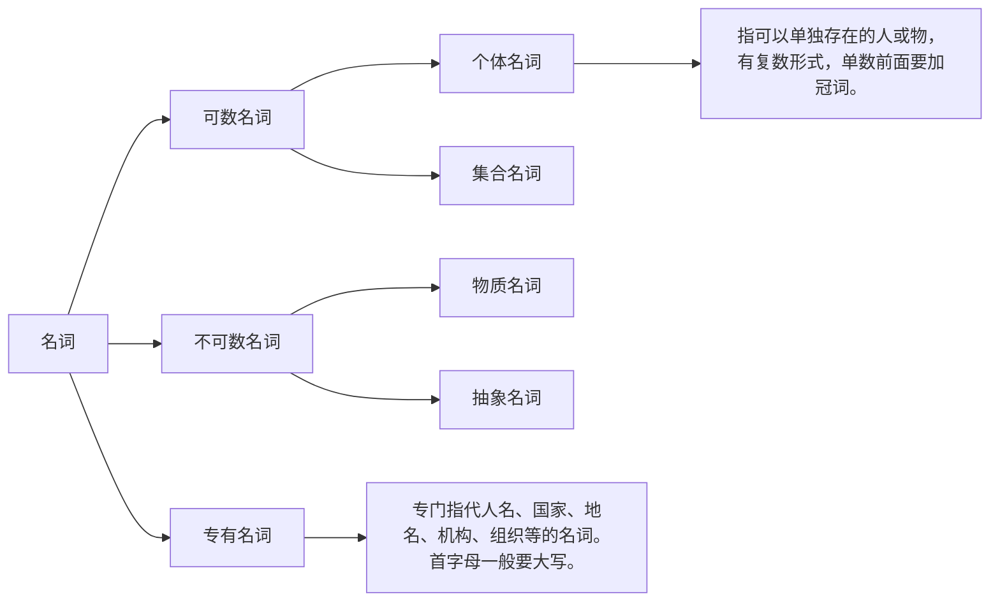

[TOC]

> 前言
>
> 1. 本笔记是**跳跃式阅读**的结果，这意味着最好**看第二遍**（推荐，虽然英语我不一定会看第二遍）
> 2. 本书的**考点分析必看**，但是在**全过一遍之后再看**，这样可以**在看的过程中将句子的所有成分融会贯通**，甚至还能**锻炼翻译能力**（翻译的过程中还能加深单词的印象）！
> 3. **电子书第一遍学习的时候，推荐多截图，而后第二遍的时候边整理笔记边思考边复习**。第一遍的时候就整理笔记纯粹是在浪费时间。因为第一遍的记笔记不过是无脑打字，而第二遍是边打字边思考！

## 简单句

### 中英文句子比较

- 英语句子的**主语必须是谓语动作的发出者**，**宾语是谓语动词的承受者**。

  - 重庆江北机场就要到了

    【正确】：We are arriving at Chongqing Jiangbei Airport.

    【错误】：Chongqing Jiangbei Airport is arriving. （机场自己不会长腿来到我们面前）

  - 北京下雨了

    【正确】：It is raining in Beijing.

    【错误】：Beijing is raining. （北京是个地方怎么会下雨？是天下雨了）

  - 我要去理发

    【正确】：I will ask a barber to cut my hair. / I will have my hair cut.（have sth. done 是特殊用法，翻译为“让某事被做”）

    【错误】：I will cut my hair. （理发这个动作不是我发出的）

  - 饭吃了吗，你？

    【正确】：Have you had lunch?

    【错误】：Lunch eat?

英语是**形合语言**：形式上强调语法和句法要完整合理，具有结构美。英语语法比较固定，规律性强。比如：英语语法规定要有**主语和谓语**才能构成一句话，并且主谓的关系是确定好的，必须**发出谓语动作才能作主语**。英语的句子常用**词形变化**（如名词变动词、形容词变名词）、**虚词**（如冠词、介词、连接词）、**非谓语动词**（不定式、动名词、分词）、**各种从句和独立主格**等表现各种**语法关系**，结构紧凑严密，注重以形显义。结构主义语言学家认为，英语是一种结构式的语言。因此，有人将英语的句法结构称为“树形结构”，干上有枝、枝上有干、节外生枝。

汉语是**意合语言**：中文用简单的语言单位就可以表达思想，不讲究太多主谓宾以及主谓的顺序，只要汉字凑在一起能表达完整的意思就行了，即使语法不完整、不合理也无关紧要，具有意境美。

**对于英汉句法结构的差异，我们可以做一个比喻**：

- 汉语的句子结构好比一根竹子，一节一节地连下去
- 英语的句子结构好比一串葡萄，主干可能很短，但有累累果实附在上面。这些果实就是定语、状语、同位语等修饰成分。

【to be continue】

### 英文句子基本结构

一个英文句子无论多长，都是**在一个基本结构上进行延长**的。

- 主语 + 谓语

  - 主语 + 不及物的谓语动词

- 主语 + 谓语 + 宾语

  - 见 `主语 + 谓语（系动词） + 表语`

- 主语 + 谓语（系动词） + 表语

  - 主谓宾的谓语一定是实义动词

    - 实义动词：能够表达动作的动词，如：吃、喝、拉、撒等。

  - 主谓表的谓语一定是系动词

    - 表示状态：be 动词（连接主语和表语，无意义，用于构成句子）
    - 表示感官：look, smell, taste, sound, feel
    - 表示变化：grow, fall, turn, get, become
    - 表示保持：stand, keep, stay, remain
    - 表示表象：seem, appear
    - 表示结果：prove

    注意，以上有些单词既可以作系动词，又可以作实义动词。区分的唯一办法是看它们再句子中的意思。

- 主语 + 谓语 + 间接宾语 + 直接宾语

  - 双宾就是两个宾语，它们之间是没有关系的

  - 是否能区分直接宾语和间接宾语对我们写句子的影响不大

    - He returned me my textbook.
    - He brought me some candies.
    - He told me a story.

    

- 主语 + 谓语 + 宾语 + 宾语补足语

  - 宾补是对前面宾语的补充说明，说明它们有关系。

  - 宾语补足语：补充说明宾语的特点、身份，或让宾语完成某个动作。充当宾语补足语的常常是名词、非谓语结果（分词和动词不定式）、形容词、副词、介词短语等。

    - We should keep the door **open**. （形容词）
    - We named our baby **Youyou**. （名词）
    - His father told him **to make friends** carefully. （动词不定式）
    - My father heard the boys **playing basketball** outside. （现在分词）
    - I had my watch **repaired** yesterday. （过去分词）

    

    **区别双宾和宾补**的简单方法是：在二者之间加 is，如果语义通顺，则是宾补，反之是双宾。

【to be continue】

### 简单句精华之主干

句子主干：五种基本句型，是一个长难句**最本质并且包含句子最核心意思的部分**。需要注意的是，这五种基本句型的**每个组成部分都是会变长的，导致句子变复杂**。

#### 搞定谓语

谓语是一个句子的灵魂

##### 谓语成分\*

具有时态的（含情态动词的谓语先排除）实义动词（词组）或者系动词

- 一定是系动词或实义动词（词组）
- 会根据不同的时态发生相应的变化

> [!CAUTION]
>
> 此处暂未提到情态动词，后续完善一下

> [!NOTE]
>
> 动词具备了时态有时候还不够。如果主语自己不能发出动作，就需要使用被动语态（**有时候是没看到主语，但是英语中主语是必须存在的**）。
>
> 举例：
>
> 前面正在盖房子
>
> 【错误】The front is building the house.
>
> 【正确】The house is being built in front.

##### 一句话中能否出现两个或两个以上的动词或动词词组

1. 谓语只能由动词（词组）来充当
2. 动词（词组）只能充当谓语

对于不能作谓语的动词（词组），**变成非动词形式即可**：

- **动名词**：起**名词**作用
- **现在分词**：表示主动或进行（主动居多）
- **过去分词**：表示**被动**或完成（被动居多）
- **不定式**：表示**目的**或将来（目的居多）

**非谓语动词**可以充当除谓语外的任何成分

- 作主语

  
  （图片待转文字)

- 作表语

  - Her job is <u>to teach Englsih</u>: 她的工作是教英语
  - Her dream is <u>to become a rich lady</u>: 她的梦想是成为有钱人

- 【to be continue】

##### 一句话能否没有动词

【to be continue】

##### 动词的分类

###### 连系动词

- 状态：be 动词
- 感官：look, smell, taste, sound, feel
- 变化：grow, fall, turn, get, become
- 保持：stand, keep, stay, remain
- 表象：seem, appear
- 结果：prove

【to be continue】

###### 情态动词

**表明说话人主观态度的词汇**

- I cook every day：我每天都做饭

  I have to cook every day：我每天不得不做饭

  不得不做饭说明说话人并不喜欢做饭！

这也说明了情态动词不能单独出现，后面必须接实义动词（词组）或系动词一起构成谓语。

**分类：**

- may/might
  - 表示请求和允许
    - May I borrow your pen tomorrow?
  - 表示推测可能性
    - It might rain tomorrow.
  - 表示希望、祈求、祝愿
    - May you have a good time.
- must
- can/could
- need
- dare
- shall/should/ought to
- will/would
- used to

【to be continue】

###### 助动词

【to be continue】

> [!CAUTION]
>
> 暂且跳跃式学习，后续才回头总结整理

#### 搞定主语

主语：一个动作的发出者。

##### 主语的成分\*

- **代词**
  - <u>She</u> is a teacher.
- **名词（短语）**
  - <u>Her job</u> is to teach English.
- **非谓语结构**
  - <u>Helping you learn English well</u> is her task.
- **从句**（引导词 + 句子）
  - <u>That she will quit his job as an English teacher</u> has upset every one of us.

切记，单纯的句子（主语 + 谓语）是不能充当任何成分的！如果想让其充当成分，就必须将其变成从句，也就是在句子前面加上正确的引导词。

##### 主语能否缺失

很多中文句子主语不是谓语动作的发出者，或者本身就没有主语，这种情况有三种解决办法：

###### there be 句型

- 她的包里有一封情书：There is a love letter in her bag.
- 一年有四个季节：There are four seasons in a year.
- **有很多原因能解释为什么精神的富足最重要**：There are numerous factors **explaining** why spiritual abundance is the most important.

上面三句话的共同点：

1. 都有“有”字
2. 都没有主语

###### it 作形式主语

###### 被动

> **被动语态**
>
> 第一，
>
> 第二，
>
> 第三，

**第三，被动语态的具体用法**

只要这句话的主语不能发出这个动作，都可以考虑使用被动语态！

**第四，被动语态与主动语态的转换**

**第五，需要注意，以下几种情况无被动形式**

> [!CAUTION]
>
> 上述内容没看进去，需要重新看

【to be continue】

###### 人称代词作主语

这是最后的选择！只有当 it、there be、主动变被动都行不通时，才加人称代词作主语。

#### 搞定宾语

##### 宾语的成分（同主语）\*

- **代词**
  - The students admire <u>her</u>.
- **名词（短语）**
  - Dayan receives <u>a love letter</u>.
- **非谓语结构**
  - Tiedan enjoys <u>browsing TicToc</u>.
- **从句**（引导词 + 句子）
  - We should believe <u>that our destiny is in our own hands</u>.

为什么充当主语和宾语的成分是一样的呢？因为它们可以通过被动句互换位置！所以成分要一致。

#### 搞定表语

##### 表语的成分\*

- **代词**
  - It's <u>me</u>.
- **名词（短语）**
  - That remains <u>a puzzle</u> to me.
- **非谓语结构**
  - My job is <u>to teach English</u>.
- **从句**（引导词 + 句子）
  - This is <u>what Tiechui's  mother said</u>.
- **<u>形容词（短语）</u>**
  - Dayan keeps <u>silent</u>.
  - She looks <u>negative</u>.
- **<u>副词（短语）</u>**
  - The sun is <u>up</u>.
- **<u>介词（短语）</u>**
  - Tiechui is not <u>at home</u>.

### 第四节 简单句的考点分析

#### 写作

【to be continue】

#### 长难句分析

【to be continue】

## 并列句

**回顾一下简单句中英文差异的对比：**

- 汉语注重意合，英语注重**形合**（强制要求一定的结构）
- 汉语多主动，英语多**被动**

现在开始引入英汉语言的最大差异：

- 汉语多短句，英语多长句

**中文多个短句翻译成英文的长句的方法**：

- 留一个句子作主语，剩下的都变成从句
  - That life **itself is trouble and pain** is the view of many people.（主从复合句）
- 用连词写成并列句
  - I fell in love with the guy **sitting in front of me** <u>because</u> he looked so elegant.（because 连词）
- 写成独立主格结构：**只留一个动词，多余动词改为非谓语结构**
  - Life itself <u>being trouble</u> and pain, it is the view of many peple.
  - I loving you, you fall in love with Dayan.

### 什么是并列句

由**并列连词**连接的两个或两个以上的句子。这几个句子可以是简单句，也可以是带有从句的复合句。

**举例：**

- ①: He always works hard at everything.
- ②: My mother asks me to learn from him.
- Σ: He always works hard at everything, **so** my mother asks me to learn from him.

- Σ: My boyfriend promise me **that he really loves me** and **that he will speed all his life protecting me**.

### 连词分类及区别\*

#### 常见的并列连词\*

- **平行**关系

  - and
  - not only... but also...
  - both... and...
  - **neither... nor...**

- 转折关系

  - but

  - while

    - Peole are all struggling in life. Some rise from the ashes, **while** others fall to pieces.

      人们都在人生的苦难中挣扎，有些浴火重生，有些却粉身碎骨。

  - **yet**

  - whereas

- **选择**关系

  - or
  - whether... or not...
  - **either... or...**

- 因果关系

  - because
  - since
  - for
  - so

  

#### 表示逻辑关系的其他词（副词和介词短语）\*

表示逻辑关系的**其他词**比连词能表达的范围多很多，因为连词有时候不能表达一些逻辑关系，比如**递进关系**。

- **平行**关系

  - **equally**
  - **similarly**
  - **likewise**
  - **simultaneously**
  - at the same time
  - in the meanwhile

- **递进**关系

  - then
  - also
  - besides
  - furthermore
  - moreover
  - additionally
  - **subsequently**
  - in addition

- 转折关系

  - however

  - **nevertheless**

  - **nonetheless**

    - Peole are all struggling in life. Some rise from the ashes, **and nonetheless** others fall to pieces.

      人们都在人生的苦难中挣扎，有些浴火重生，有些却粉身碎骨。

  - **conversely**

  - **contrarily**

  - **unfortunately**

  - unexpectedly

  - on the contrary

  - by contrast

  - on the other hand

- 选择关系

  - **alternatively**

- 因果关系

  - 因为

    - because of
    - **be responsible for**
    - **due to**
    - **owing to**
    - thanks to

  - 所以

    - **thus**

    - **hence**

    - **consequently**

      - Romain Rolland once said, "You learn by doing wrong". As as consequence, you should do something wrong in life.

        罗曼·罗兰曾经说过，“做错事才能长见识”。所以人生应当做错一些事情。

    - therefore

    - **as a result**

    - **as a consequence**

- 总结关系

  - **on the whole**
  - **all in all**
  - **overall**
  - **in conclusion/summary/general**
  - **generally (speaking)**
  - **as a whole**
  - **mainly**
  - **substantially**
  - **to sum up**
  - **to conclude**
  - in short/brief
  - in a word

- 表示引出新对象（多为介词或介词短语）

  - 关于：about = concerning = regarding = with regard to = as for/to = in respect of
  - 就 ... 而论、在 ... 方面：in terms of

#### 同义连词与其他逻辑关系词的区别

认真比较以下两组句子：

① He failed many times, but he didn't despair. / He failed many times but he didn't despair.

② He failed many times. On the contrary, he didn't despair. / He failed many times, and on the contrary, he didn't despair.

得出以下结论：

- 使用连词时，句子之间**加**逗号**或不加**逗号**都可以**。

- 使用副词或介词短语表示上下文逻辑关系时，**句子之间不能用逗号**，因为逗号不能连接两个句子，副词或介词短语也不能连接两个句子。

  **如何解决这个问题？**

  把逗号变为句号，或者在副词或介词短语前面加连词 and

### 并列句的考点分析

#### 写作

英文的写作具有很强的逻辑性，这种逻辑性就体现在一些逻辑关系词上面。

【to be continue】

#### 长难句分析 

【to be continue】

## 修饰成分

### 搞定同位语\*

语法长难句的三大修饰成分：定语、状语和同位语。

英文的很多长难句就是进行很多步骤的修饰，**最终看起来错综复杂**。

> [!CAUTION]
>
> 在我看来，同位语不简单，不要按照定语从句理解了，需要真正弄懂！

#### 什么是同位语

- 在英译汉时，即便没有区分同位语，按照**定语从句**的翻译方法处理依然不影响对句意的理解
- 考研**不会明确考察大家如何去详细地区分**什么是定语从句，什么是同位语从句

同位语是**用来解释或补充说明名词的成分**，通常在名词后。从字面意义上来理解，同位语**即相同地位的语言**。

- Dayan, my wife, is so beautiful.

  我们发现 Dayan 和 my wife 是相互解释说明的关系。**两者去掉任何一方，句子都是成立的**。

- We, Chinese people, are brave and hardworking.

  Chinese people 用来解释 We 是谁。两者的地位作用一样。

#### 什么可以作同位语\*

- **代词**

  - I cannot bear the girl in front of me, <u>her</u>.

    我不能忍受我前面的哪个女生——她。

- **名词**

  - Tiechui, <u>a handsome boy</u>, never fails to fasciante me.

    铁锤，一个帅气的男生，总是让我着迷。

  - I enjoy the movie, <u>The Shawshank Redemption</u>.

- **非谓语结构**（分词和不定式）

  - I enjoy this sport, <u>plaing basketball</u>.
  - He has a dream <u>to travel round the whole world</u>.

- **从句**（引导词 + 句子）

  - The news <u>**that our women volleyball team**</u> had won the championship encouraged us all greatlly.

    我们女排赢得冠军的消息大大地鼓舞了我们所有人

> [!IMPORTANT]
>
> 成分和主语宾语一致！

A boy wrote the name of Beckham, **a well-known British football player**, on his face.

【to be continue】

#### 名词性从句

同位语从句用来对其前面的抽象名词**进行解释说明**，被解释说明的词和同位语**在逻辑上**是**主语和表语**的关系。**这属于名词性从句的范畴**。此处引出名词性从句概念是为了将第一章欠下的**主语从句、宾语从句和表语**从句补上

##### 什么是名词性从句\*

- 主语从句
  - <u>What I saw last night</u> is encouraging.
- 宾语从句
  - I appreciate <u>what the hero said in the movie</u>.
  - 
- 表语从句
  - He is <u>who we should learn from in despair</u>.
- 同位语从句
  - I enjoy the movie <u>in which/where Andy saved himself with great ambition</u>.（从句作**定语**）
  - 
  - 
  - 【to be continue】

上述例句中，我们能够清晰地看到：**名词能够在句子中充当的成分，从句都能充当**。由于名词可以作主语、宾语、表语和同位语，相应地，我们就有了主语从句、宾语从句、表语从句和同位语从句。那么什么是名词性从句也就一目了然：**能够作为名词在句子中充当成分的从句**，就是名词性从句。名词性从句不是一种从句，而是四种从句。

##### 名词性从句的引导词\*

- **that**：当从句是**陈述句**时。（需要注意的是 that 在从句中**不充当成分**，**也没有实义**）

  - 他**能**赢得这场比赛是很确定的。（能 --> 陈述句）

    【错误】He will win the competition is certain.

    【正确】**That** he will win the competition is certain.

- **whether**：当从句是一般疑问句时。（whether 在从句中**不充当成分**，但意思为“**是否**”）

  - 他**能否**赢得这场比赛还不得而知。（能吗？--> 一般疑问句）

    【错误】Will he win the competition is still a question.

    【正确】**Whether** he will win the competition is still a question.

    **使用 whether 时，需要把一般疑问句写成陈述句**。因为 whether 的意思是“是否”，一般疑问句本身也暗含了“是否”的意思！

- **特殊疑问词**：当从句是特殊疑问句时。

  - 常见的连接副词

    - when

    - where

    - why

      - 他**为什么**能赢得这场比赛是很明显的。（为什么？--> 特殊疑问句）

        【错误】Why can he win the competition is self-evident.

        【正确】Why he can win the competition is self-evident.

        **请将疑问句写成陈述句的形式！**

    - how

  - 常见的连接代词

    - who
    - whom
    - what
    - which
    - whose

**小试牛刀：**

- <u>**That** people are indifferent to you</u>  <u>when you are at a low point</u> is quite self-evident.

  当你身处低谷时，周围的人会对你很冷漠是显而易见的。

- <u>**Why** his family left Henan for Xinjiang</u> at the beginning <u>is as secret</u> until now.

  他们全家当初为什么离开河南去新疆至今为止都是个秘密。

- **That** reading is to purify our minds is beyond dispute.

  读书的目的是净化我们的灵魂是毋庸置疑的。

- **Althoogh I have been married, whether you really loved me has been my doubt.**

  虽然我已经结婚了，但是你是不是真的曾经爱过我一直是我的疑惑。

- 

- 

- 【to be continue】

#### 名词性从句的考点分析

##### 主语从句的考点分析

【to be continue】

##### 宾语从句的考点分析

【to be continue】

##### 表语从句的考点分析

【to be continue】

##### 同位语从句的考点分析

【to be continue】

### 搞定定语\*

> [!IMPORTANT]
>
> 定语作为一个考点，一直是考研的重中之重，在研究生考试中占比非常高。
>
> 不管是在阅读理解还是写作中，**掌握好定语能让我们轻松一大半**！
>
> ---
>
> 定语之所以是难点，主要在于大多数情况下，定语的位置往往在所修饰名词的后面，即后置定语，这跟我们中文的语序逻辑相悖：
>
> 

#### 什么是定语

定语是**修饰限定名词（短语）的语言**。

定语可以对名词进行“化妆”改造，直白一点：只要听到“**······ 的**”后跟名词，“**······ 的**”就是这个名词的定语成分！

> [!CAUTION]
>
> 定语主要修饰的是名词，它还可以修饰：
>
> - 代词
>   - That boy 的 That？
> - 动名词
> - 名词性从句
>
> 一言以蔽之：**类名词的成分**
>
> 关于类名词，比如名词可以作：主语、宾语、表语

#### 什么可以作定语\*

- **代词**

  - That boy.
  - His wife.

- **名词（短语）**：这个名词是特殊结构的名词才能充当定语！

  - The stockbroker**'s** dream is to become a painter.

    The dream **of** the stockbroker is to become a painter.

    **推荐使用第二种写法**，即介词短语作后置定语。

- **非谓语结构**

- **从句**

  - Ata has been taking care of the man <u>who finished the giant mural</u>.

    爱塔**一直照顾着**完成了巨型壁画的这个男人。

- 形容词（短语）

  - a handsome boy.

- 介词（短语）

  - This is a story <u>about the moom and six pence</u>.

在考研时常考查的短语分为三种类型：**介词短语、分词短语和 to do 不定式短语**。这三种短语作定语修饰名词时，都放在名词后面，属于后置定语。

- 介词短语

  - The hero <u>**without any painting foundation**</u> dreams of becoming a painter.
  - Although there may not have been mush love <u>between them</u>, he still marriied a native girl <u>on the island</u>.

  上述两个例子，给我们启示：下次再遇到**名词后面是介词短语**时，不妨就用这种逻辑去理解修饰关系。

- 分词短语（v-ing, v-ed）

  - **现在分词**短语作**后置定语**，一般表示与所修饰的名词是**主动关系**
    - The man <u>abandoning his family and job</u> went to Paris.
  - **过去分词**短语作**后置定语**，一般表示与所修饰的名词是**被动关系**
    - The hero <u>infected with leprosy</u> continues to paint as if death had never been close to him.

- to do 不定式短语

  - sample one

    - 许多人承担责任

      Many people assume their responsibilities.

    - 许多人承担起**完成这项工作的**责任

      Many people assume their responsibilities **to finish the work**.

  - sample two

    - 铁锤是个好人

      Tiechui is a nice person.

    - 铁锤是**可以合作得很好的**工作伙伴

      Tiechui is a nice person **to work with**.

> 后置定语如何翻译？
>
> 首先，我们需要**识别出**后置定语这一“化妆”手段，然后在**脑海中**将定语前置，翻译到名词之前。

#### 细说定语从句\*

##### 定语从句的构成部分

Her favorite celebrity is Ma Long who is good at playing table tennis.

上述例句的**语法分析**如下：

- **先行词**：Ma Long（即定语从句所要修饰的名词）
- 引导词：who
- 分句：is good at playing table tennis.

##### 定语从句的引导词\*

###### 按照所修饰的先行词进行分类

- 先行词是人
  - that
  - who
  - **whom**
  - **whose**
- 先行词是物
  - that
  - which
  - **whose**
- 先行词是时间
  - that
  - <u>which</u>
  - **when**
- 先行词是地点
  - that
  - <u>which</u>
  - **where**
- 先行词是原因
  - that
  - <u>which</u>
  - **why**

**举例：**

① Tiechui is the millionaire <u>that/who</u> falls in love with Dayan.

② Tiechui is the millionaire <u>that/who/whom</u> Dayan falls in love with.

③ Tiechui is the millionaire <u>whose</u> father is impoverished.

关系代词：

- that：可以指人和物，在从句中充当主语或宾语
- who：一般只用来指人，在从句中既可以充当主语也可以充当宾语
- whom：一般只用来指人，在从句中**只能充当宾语**
- whose：可以指人和物，但只能在从句中**充当定语**

> 分析的时候，**优先找先行词**，其次**找从句缺少什么成分**。

###### 按照引导词本身的词性或者在从句中充当的成分

- 代词（在从句中可充当主语、宾语、表语）
  - who
  - whom
  - which
  - that
- 副词（在从句中不能充当主干成分）
  - where
  - when
  - why
- 形容词（在从句中只能可充当定语，修饰名词或短语）
  - whose
    - Q: 形容词是否可以充当表语？p104

【to be continue】

##### 定语从句的先行词\*

###### 先行词的难点

 

###### 识别先行词

- 并没有便捷的办法。**办法只有一个，那就是读懂句子**。只有读懂句子，才能确定定语从句的先行词到底是什么。（归根结底，单词是最重要的）
- 不必害怕，因为**在绝大多数情况下，先行词和引导词都是连在一起的**。也就是说，不是所有题目都需要查找定语从句的先行词。

同位语？这样的话，冒号后面的内容是否没那么重要呢？即使难以理解。

> [!CAUTION]
>
> 上面这句话非常适合练习自己的语法分析能力！太美妙了，很多**非关键内容的单词不认识也可以**，只要**把结构划分出来**，就能理解个大概，**再增加一些对介词的理解**，就能更准确理解句子的本意了。

【to be continue】

#### 定语从句的特殊用法

##### 限制性和非限制性定语从句

很多同学以为限制性定语从句和非限制性定语从句的区别在于是否有逗号来区分，这是不对的。其实它们最大的区别是**表达意义上的不同**。

###### 区别一

- I have a brother who is a docotor. （**限制性**定语从句，无逗号！）

  我有一个当医生的弟弟。

- I have a brother, who is a docotor.（**非限制性**定语从句，有逗号！较灵活！）

  我有一个弟弟，他是当医生的。

第一句暗含的意思：我的弟弟可能不止一个，其中有一个是做医生的。

第二句：我只有一个弟弟，我这个弟弟是做医生的。

###### 区别二

- People who eat healthy live longer.
- Tiechui's daughter, who is in Beijing now, will come back home next week.

第一句是限制性定语从句，去掉定语从句后，这句话就变成了“人活得更长”，**就没有什么意义了**。

第二句是非限制性定语从句，定语从句可以去掉，因为**它仅仅起补充说明的作用，相当于插入语**。去掉定语从句后句子依然有意义：铁锤的女儿下周回家。

【to be continue】

##### 省略 that 的情况

在定语从句中，如果**引导词 that 充当的是宾语**，则可以被省略。比如：I enjoy the movie (that) we saw yesterday.

**所以**，分析长难句时如果看到**两个名词（短语）或代词直接放在一起**，则**很可能是省略了 that **的定语从句。

> [!CAUTION]
>
> 两个名词（短语）或代词直接放在一起！！！
>
> - the vital part (that) forests

**非常值得分析的例句**

- The climate change we are hastening could one day leave us with forests that emit more carbon than they absorb.

  【deepseek】：我们正在加速的气候变化，终有一日可能导致森林的碳排放量超过其吸收量。

  【mine】：我们正在加速的气候变化在某一天将使我们面对吐出二氧化碳大于吸收二氧化碳的森林。

  - **主句**：The climate change could ... leave us with forests ...
    - 主语：The climate change
    - 谓语：could leave 
      - "leave" 表示结果（“使…处于某种状态”）
    - 宾语：us 
    - **宾语补足语?**：with forests ...
      - 介词短语描述结果（“使人类**面临**某种森林”）
  - 定语从句：we are hastening
  - 宾语补足语中的定语从句：that emit more ... than they absorb
    - emit vs. absorb：**动词对比**，描述森林从“吸收碳”变为“排放碳”。
    - han they absorb：**比较状语从句**，简化后为 than (the carbon) they absorb。
  - **比较结构**：more carbon than they absorb

> 上述内容有些朝纲，涉及比较状语从句了，待到状语从句学完应该能加深理解。

- Only recently have they come to see the vital part forests will have to play in storing carbon.

  直到最近，他们才逐渐认识到森林在碳储存中必须发挥的关键作用。

  - 倒装结构标记：Only recently
  - 助动词 + 主语：have they
  - 谓语：come to see
  - 宾语：the vital part
  - 定语从句： forests will have to play...
  - 介词短语：in storing carbon（“在碳储存中”）

- The potential evolution of today's technology, and its social consequences, is dazzlingly complicated, and **it's perhaps best left to science fiction writers and futurologists to explore the many possibilities we can envisage**.

  - **形式主语**：it
  - 实际主语：to explore the many possibilities ...
  - 定语从句：(that) we can envisage
    - Q：we can envisage the many possibilities（我们可以设想到许多可能性），这变成定语从句为什么感觉这么奇怪？这变成定语从句意思是：我们所能设想的诸多可能性？
  - 谓语：is perhaps best left to （**被动语态，表示“最好由…来处理”**）
  - 宾语：science fiction writers and futurologists

- 
  

> [!NOTE]
>
> 怎么识别是否省略 that？
>
> 从上面的例子中我们可以看出，**只要见到两个名词或代词直接放在一起，中间没有被任何标点符号或连词隔开**，通常都是省略了 that 的定语从句。
>
> 当然，肯定有特殊情况的，比如：
>
> > [!CAUTION]
> >
> > I shall define him as an individual who has elected <u>the activity of thinking about moral problems</u> as his primary duty and pleasure in life.
> >
> > 我将把知识分子定位为这样一种人：他把思考道德问题的活动作为自己生活的主要责任和乐趣。
> >
> > 太无语了，这句话，这样看稍微能理解，但是英语喜欢调整位置。。。
> >
> > 实际上是：
> >
> > I shall define him as an individual who has elected as his primary duty and pleasure in life the activity of thinking about moral problems.
> >
> > >  总之，吃一堑长一智，有的时候，英语句子读不懂，试试把各部分位置移动一下，拼接翻译？
> > >
> > > 当然最重要的还是单词，不然理解有偏差的话，会导致移动时在瞎移动！

##### as 和 which 引导的非限制性定语从句

###### 相同点

as 和 which 都可以引导非限制性定语从句，且 **as 只能引导非限制性**定语从句，而 which **还可以**引导限制性定语从句。

###### 不同点

- as 引导非限制性定语从句，位置比较灵活。可以放在主句的前面、主谓之间或主句的后面，翻译为**正如**。而 which 引导的非限制性定语从句**只能放在所修饰的词或句子的后面**。

  众所周知，不努力就会一事无成：

  - As is to us all known, without efforts nothing can be achieved.
  - Without efforts nothing can be achieved, which is known to us all.

- **紧跟在引导词 as 后的动词是 be 动词**，而 which 后面可以是任何类型的动词

  众所周知，中国是一个爱好和平的国家：

  - As is known to all, China is a peace-loving country.

  铁锤迟到了，这使刘女士很生气：

  - Tiechui was late, which made Mrs. Liu very angry.

> 本小节说明，as 也是个引导词，类似 which 一样理解即可，只是二者使用时有些相同点和不同点。
>
> China is a peace-loving country as is known to all（这句话 as 这样放置不对，但是有助于理解）

##### 固定搭配 the same ... as 和 the same ... that 引导的定语从句

##### 先行词是人时，that 和 who 的区别

###### 用 who 不用 that 的情形

> ...

###### 用 that 而不用 who 的情形

这小节的上面的内容在我看来，记住不太可能，见得多了有感觉了可能才算记住。

##### 定语从句中引导词 which 和 that 的区别

###### which 适用情况

（同 who 与 that 的区别）

###### that 适用情况

##### “介词 + 关系代词”引导的定语从句

该部分对写作和长难句帮助不大，但是同学们如果感兴趣，可以做选择性阅读。

【to be continue】

#### 定语从句和同位语从句的区别

- I heard the news that he told me.
- I heard the news that she won the competition.

#### 定语的考点分析

【to be continue】

> [!CAUTION]
>
> 必须反复回顾，定语的知识非常重要！

### 搞定状语\*

定语**主要**是给**名词**“化妆”的，但是句子中不是只有名词才有资格被修饰的，**还有其他地方也可以进行“化妆”**。

#### 什么是状语

状语是**表示状态或者程度的语言**，主要可以修饰**形容词、副词、动词甚至整个句子**。（名词短语也可以）

也就是说，一个句子当中除了**名词可以用定语**进行“化妆”，还可以**用状语为形容词、副词、动词或者句子**进行“化妆”。

> 还是有点小困惑，大概就是状语的目的是什么？修饰？
>
> 我认为似乎比定语还重要，很多定语只是单纯的修饰（暂排除从句），删除掉对句意的理解并不会有偏差。
>
> 但是状语如果删掉，似乎会导致信息不完整？

#### 什么可以作状语\*

- **非谓语结构**
- **从句**

- 副词（短语）

  - Tiechui's painting is <u>really</u> awsome.

    副词 really 修饰**形容词** awsome

  - Tiechui did this job <u>very</u> well.

    副词 very 修饰**副词** well

  - Tiechui worked <u>hard</u>.

    副词 hard 修饰**实义动词** work

  - <u>Unfortunately</u>, Tiechui failed the English exam.

    副词 Unfortunately 修饰**整个句子**

- 介词（短语）

##### 副词作状语

在英文中，副词可以修饰形容词、副词、动词或者整个句子。**但这个不需要深究，我们按照中文的逻辑去分析，只要认识单词就不会对理解句子产生困难。**

##### 介词短语作状语

如何识别介词短语是到底作定语还是状语？

判断介词短语的类型是不是下面的六种类型，**是则优先考虑状语**。

###### 表示时间

- My daughter is eager to get her lucky money <u>on New Year's Eve</u>.

  介词短语虽然位于名词 money 后面，但是**由于它表示时间**，所以不能作定语，而是**作时间状语**，说明我女儿想要拿红包的时间状态。

- We often have breakfast <u>at 7:00 am</u>.

###### 表示地点

- Students all sit <u>in the middle of the room</u>.
  - 句子结构：
    - 主语：Students（学生们）
    - 副词：all（都）
    - 谓语动词：sit（坐下/坐着）
  - 动词 "sit" 的特性：
    - 不及物动词：**无需宾语**，但需依赖上下文或状语补充信息。
    - 独立使用：**语法正确，但信息可能不完整**（需语境即上下文支撑）。
- My son and I live <u>in Chongqing</u>.

> [!NOTE]
>
> 在考研中，介词短语表示时间或者地点都不是重难点，大家只需要能看懂意思即可。

###### 表示原因\*

> 该部分内容是超重点内容：介词短语表示原因

- because of
- **due to**
- **owing to**
- **on account of**
- thanks to
- **as a result of ...**

**例句：**

- The sports meeting was cancelled **because of** the heavy rain.

  运动会因为下大雨取消了。

- **As a result of** the heavy rain, the sports meeting was cancelled.

  因为下大雨的缘故，运动会被取消了。

- He had a bad accident **due to** his careless driving.

  他遭遇这次严重的车祸是由于驾驶疏忽。

- **Owing to** his careless driving, he had a bad accident.

  由于驾驶疏忽，他发生了严重的车祸。

> [!NOTE]
>
> due to 通常不放在句首
>
> owing to 通常放在句首
>
> 其他短语的位置可前可后
>
> 例如：
>
> - The country's economic problems are largely due to the weakness of its recovery.
>   - 句子结构：
>     - 主语：The country's economic problems
>     - 系动词：are
>     - 表语：largely  due to the weakness of its recovery
>     - 副词修饰：largely
>     - **后置定语**：of its recovery
> - Owing to his classmates' help, he has made rapid progress.

###### 表示方式

**方式状语**指用来**表达主语完成某个动作或者某种状态时使用的方式**。

**通过：**

- through
- via
- by

- It's more economical to go to Beijing by train.
  - <u>to go to Beijing</u> is <u>more economical</u> by train. （**用这样类中文的方式理解如何？**）

- Babies communicate through facial expressions and by making noises.
  - 主谓：Babies communicate
  - 方式状语 1：facial expressions
  - 方式状语 2：by making noises

- They answer the questions of students via the interactive book.
  - 主谓宾：They answer the questions
  - 定语：of students
  - 方式状语：via the interactive book

**以 ······ 方式：**

- in ... manner
- in ... way
- in ... method
- in ... fashion

###### 表示让步

**虽然，尽管：**

- in spite of
- despite
- for all

- They came to school, despite the heavy rain.
  - 主谓宾：They came to school
  - 让步状语：despite the heavy rain
- We must stick to our dreams in spite of all the difficulties.
  - 主谓宾：We must stick to our dreams
  - 让步状语：in spite of all the difficulties

**无论：**

- regardless of ...

- Everyone has equal rights regardless of religion, color, or creed.
  - 主谓宾：Everyone has equal rights
  - 让步状语：regardless of religion, color, or creed

###### 表示伴随

**伴随状语**指的是**状语的动作伴随主句发生**。常考的介词：**with**。

- He stood there, with his hand raised.
  - 主谓：He stood
  - 地点状语：there
  - 伴随状语：with his hand raised
  - 逻辑主语：his hand
  - 补语：raised （过去分词作补语）
- He lay on his bed with the sunlight falling on his face.
  - 主谓：He lay
  - 地点状语：on his bed
  - 伴随状语：with the sunlight falling on his face
  - 逻辑主语?：the sunlight
  - 补语?：falling on his face

> [!CAUTION]
>
> 主谓宾定状，任何句子只要能大致找出这五个成分，似乎就能理解的差不多了吧？
>
> 再细的话，我的实力做不到了吧。
>
> 比如：我好奇 with the sunlight falling on his face 怎么分析？
>
> 凭**感觉**来说，这句话大概就是伴随着阳光洒在他的脸上。the sunlight falling on his face 这句话**似乎**就是个短语，**表达**阳光主动洒在他的脸上...（总之，语言纠结太深对我这个半吊子而言只有坏处）
>
> 
>
> 
>
> 关于**独立主格**：
>
> 【to be continue】

##### 分词、不定式短语（非谓语动词）作状语

###### 分词短语作状语

【to be continue】

###### to do 不定式短语作状语

【to be continue】

##### 从句作状语\*

从句作状语就是状语从句

- 表目的：The teacher raised his voice <u>so that the students in the back could hear more clearly</u>.
- 表条件：You will certainly succeed <u>as long as you keep on trying</u>.
- 表让步：The old man enjoys winter swimming <u>even though it is freezing cold outside</u>.
- 表示比较：The more you exercise, the healthier you will be.
  - 主句： the healthier you will be
  - 条件从句：The more you exercise
- 表示方式：We teach our children <u>the way our parents have taught us</u>.
  - 方式状语从句：the way our parents have taught us
    - the way 引导方式状语从句，相当于 in the way that，表示“以……的方式”
    - 从句主语：our parents
    - 从句谓语： have taught
    - 从句宾语：us
  - 主谓宾：We teach our children

> 状语的位置极其灵活，可以随意放置在句中，但是放在句首或句末的情况居多。
>
> 如果放在句首的话，后面常用逗号隔开。比如：
>
> - Last night, my friend and I went to see a movie.
> - My friend and I went to see a movie last night.

【to be continue】

#### 细说状语从句

##### 构成

##### 引导词

##### 时态

#### 状语从句分类

##### 原因状语从句

##### 让步状语从句

##### 条件状语从句

##### 比较状语从句

##### 目的状语从句

##### 方式状语从句

##### 结果状语从句

##### 时间状语从句

#### 定语与状语的区别

##### 区分介词短语既像定语又像状语的情况

##### 区分 when 引导的是定语从句还是状语从句

#### as 专题补充

#### 状语从句和非谓语动词（短语）作状语的转化

#### 状语的考点分析

【to be continue】

### 句子所有成分总结

## 特殊结构

### 插入语

#### 什么是插入语

#### 什么可以作插入语

#### 插入语的考点分析

【to be continue】

### 虚拟语气

#### 什么是虚拟语气

#### 一般用法

#### 特殊用法

#### 虚拟语气的考点分析

【to be continue】

### 倒装句

#### 什么是倒装句

#### 英语中常见的倒装结构

#### 倒装句的考点分析

【to be continue】

### 强调句

#### 强调句的构成公式

#### 强调句型的考点分析

## 附录

### 动词时态

#### 最常见的五种时态

考研中最常见的时态有五种：

- 一般现在时（The simple present tense）
- 一般过去时（The simple past tense）
- 一般将来时（The simple future tense）
- 现在进行时（The present continuous tense）
- 现在完成时（The present perfect tense）

> 总结一下上述五种时态的适用场景，
>
> - 有明确的关键词，比如：
>   - 一般现在时：often, five times a day, every day 等
>   - 一般过去时：yesterday/long ago 等
>   - 一般将来时：tomorrow/soon/next 等
>   - ...
> - ...

##### 一般现在时（do/does ...）

> 摘要：
>
> - 
>
> 关键字：
>
> - 现阶段情况、状态和特征
>
> - 经常性、习惯性的动作
> - 客观事实和普遍真理

谓语动词一般为：

- **do/does**
- don't/doesn't

系动词为：

- **is/am/are**
- isn't/am not/aren't

一般现在时多用于三种情况：

- 表示**现阶段**情况、状态和特征

  - 陈述句：Tiechui is a  student.

    ​	          I work in Beijing.

  - 否定句：Dayan isn't a singer.

    ​		   I don't want to sleep now.

  - 疑问句：Are they friends?

    ​		   Do you want a cup of tea?

- 表示**经常性、习惯性**的动作

  - Dayan <u>always helps</u> others.
  - The next train <u>leaves</u> at 14:00 this afternoon.

- 表示**客观事实**和**普遍真理**

  - In summer, days **are** longer than nights.
  - The sun **rises** from the east and sets from the west.

  
  看到如下标志词时，通常考虑用一般现在时：
  
  - **频度**副词
  - often
  - sometimes
  - always
  - usually
  - seldom
  - never
  - hardly
  - **频率**词组
  - five times a day
  - once a day/week
  - twice a day/month
  - 其他词组
  - every/each day
  - in the morning
  - on Mondays
  - at weekends
  
  例句：
  
  

##### 一般过去时（did ...）

>关键字：
>
>- 过去某个时间发生的动作或情况
>
>- 过去习惯的动作或状态
>

- **did**
- didn't
- **was/were**
- wasn't/weren't

一般过去时多用于两种情况：

- 表示**过去**某个时间**发生的**动作或情况

  

- 表示**过去习惯的动作**或**状态**

  
  
  看到这些标志词，我们通常考虑用一般过去时：
  
  - **just now**
  - 一段时间 + **ago**
  - yesterday
  - **last + 时间**
  - long **ago**
  - **once upon a time**
  
  

##### 一般将来时（will do ...）

>关键字：
>
>- 将来某个时间会发生的动作
>- 将来某个时间会存在的状态

- **will do**
- won't do
- **be going to do**
- **be about to do** / **be to do**
- be + not going to do / about to do / to do

一般将来时多用于两种情况：

- 表示**将来**某个时间**会发生**的动作

  

- 表示**将来**某个时间**会存在**的状态

  
  
  看到这些标志词我们通常考虑用一般将来时：
  
  - tomorrow
  - **soon**
  - **the next** + 时间
  - **next**
  - **in** + 一段时间
  - in the future
  
  

##### 现在进行时（be doing ...）

> 关键字：
>
> - 正在发生或者这段时间正在发生的动作
> - 可以表示将来

- be doing
- be not doing

- 现在进行时一般表示**正在发生**或者**这段时间**正在发生的动作

  

- 现在进行时可以**表示将来**的含义

  - **瞬间动词**的进行**一定**表示将来

    - I am leaving. 

      我要离开了

  - **持续动词**的进行**只有**在有**将来的时间状语时**或者**将来语境**中才表将来

    - I am traveling to Beijing <u>next month</u>.

      下个月我要去北京旅行
  
  看到这些标志词通常考虑用现在进行时：
  
  - now
  - **at present**
  - **at the moment**
  - **right now**
  - **at this time**
  
  

##### 现在完成时（have done ...）

> 关键字：
>
> - 动作到现在为止已经完成或刚刚完成，强调对现在的影响
> - 从过去某时刻开始，持续到现在的动作或情况，并且有可能会继续延续下去。此时经常使用延续性动词。

- has/have done
- has/have been
- has/have not been

- 现在完成时表示动作**到现在为止已经完成**或**刚刚完成**，强调**对现在的影响**

  - 陈述句：I have already finished my homework. （我已经完成我的作业了）

  - 否定句：Li Ming hasn't handed in his homework yet. （李明到现在也没有交作业）

  - 疑问句：Have you found your lost phone? （你找到你丢失的手机了吗？）

- 表示**从过去某时刻开始，持续到现在的动作或情况，并且有可能会继续延续下去**。此时经常使用**延续性动词**。

  

  看到这些标志词通常考虑用现在完成时

  - yet（通常用在否定句中，表示：尚，还，仍）
  - already（通常用在陈述句中，表示：之前，已经，此时，早已）
  - ever
  - never
  - just
  - still
  - recently
  - lately
  - so far
  - until now
  - in the past/last 3 years
  - for + 一段时间
  - since + 过去时间点（since 引导的时间状语**从句用一般过去时**，**主句用现在完成时**）

  

- 区分：一般过去时和现在完成时的区别

  - 时间概念

    一般过去时**仅仅表示**过去的动作或者状态，**与现在无关**

    - I **lived** here ten years ago. （我十年前住在这里）

    现在完成时强调动作从过去某一时间**一直持续到现在**，这个动作有可能延续下去

    - I **have lived** here + for ten years/since ten years ago.（我在这里住了十年了）

  - 时间的表达方式

    一般过去时通常**有具体的过去时间点**，或者句子中有**过**、**了**等时间副词

    - He **went** to the cinema **yesterday**. （他昨天去看电影了）

    在汉语中听到**已经、曾经、还没**就用现在完成时

    -  I **have already phoned** him.（我已经给他打过电话了）
    - He **has not had** lunch yet. （他还没吃午饭）

  - 强调作用

    一般过去时**强调做过**某件事，现在完成时**强调已经完成**某件事

    - I **read** this book.（我**看过**这本书）
    - I **have read** this book.（我已经**看完**这本书了）

    区分 has/have been to 和 has/have gone to：

    - has/have **been** to：去了已经回来了
      - I **have been to** Hongkong before, so I know the way well.（我去过香港，所以认识路）

    - has/have **gone** to：**去而未归**
      - Dayan **has gone to** America. She cannot come to your party tomorrow. （大雁去美国了，她明天不能参加你的聚会了）

> [!CAUTION]
>
> 以上五种常见时态，即便过了一遍理解依旧不够深刻。
>
> 需要反复学习 + 在后续学习单词、阅读、翻译、作文等中加以巩固，最终培养出来语感（阅读和翻译）。

#### 阅读难点时态和不常见的时态

以上是考研中常考的时态，也是我们比较熟悉的，接下来来看一些阅读中可能出现的难点时态以及其他不常见的时态：

- 【to be continue】

##### 过去进行时

##### 过去将来时

##### 过去完成时

##### 现在完成进行时

##### 过去完成进行时

##### 将来完成时

##### 将来进行时

##### 过去将来进行时

##### 过去将来完成时

##### 将来完成进行时

##### 过去将来完成进行时

【to be continue】

### 词性用法

本部分为补充内容，比较基础。功底比较好的同学翻阅即可；基础较弱的同学，可以将其作为复习参考。

#### 名词

【to be continue】

（额，算了不必跳过，抽时间慢慢看吧，内容有点多又有点枯燥。。。）

#### 代词

#### 形容词

#### 副词

#### 动词

#### 冠词

#### 介词

#### 连词

### 语法改错练习

#### Jobs for Graduates

#### Occupying the Seat

#### Reading Selectively or Extensively

#### Reading Classics

#### Traveling Abroad

#### Reading

## 总结

### 单词

| 单词        | 翻译 |
| :---------- | ---- |
| combat      |      |
| premium     |      |
| distraction |      |
|             |      |
|             |      |
|             |      |
|             |      |
|             |      |
|             |      |
|             |      |
|             |      |
|             |      |
|             |      |
|             |      |
|             |      |
|             |      |
|             |      |
|             |      |
|             |      |
|             |      |
|             |      |
|             |      |
|             |      |
|             |      |
|             |      |
|             |      |
|             |      |
|             |      |
|             |      |
|             |      |
|             |      |
|             |      |
|             |      |
|             |      |
|             |      |
|             |      |
|             |      |
|             |      |
|             |      |
|             |      |
|             |      |
|             |      |
|             |      |
|             |      |
|             |      |
|             |      |
|             |      |
|             |      |
|             |      |
|             |      |
|             |      |
|             |      |
|             |      |
|             |      |
|             |      |
|             |      |
|             |      |
|             |      |
|             |      |
|             |      |
|             |      |
|             |      |
|             |      |
|             |      |
|             |      |
|             |      |
|             |      |
|             |      |
|             |      |
|             |      |
|             |      |
|             |      |
|             |      |
|             |      |
|             |      |
|             |      |
|             |      |
|             |      |
|             |      |
|             |      |
|             |      |
|             |      |
|             |      |
|             |      |
|             |      |
|             |      |
|             |      |
|             |      |
|             |      |
|             |      |
|             |      |
|             |      |
|             |      |
|             |      |
|             |      |
|             |      |
|             |      |
|             |      |

