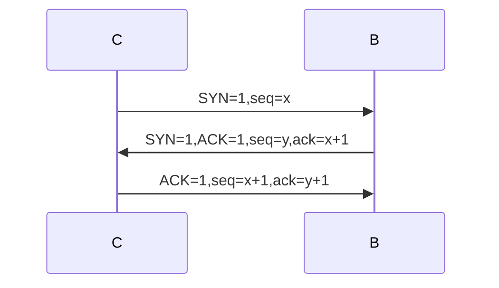
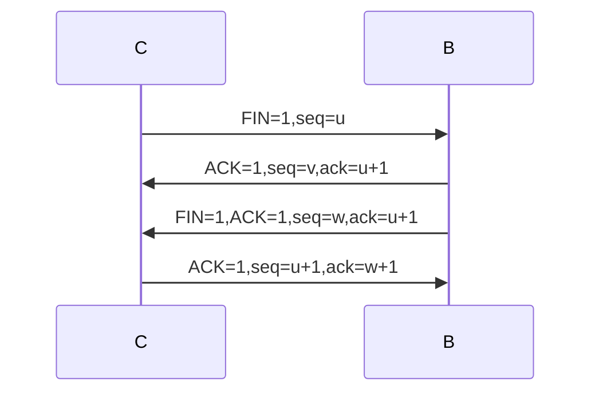

[TOC]

## 网络体系结构

## 数据链路层

### 流量控制与可靠传输机制

#### 停止-等待协议

**ACK 迟到：**

如果，第一个迟到的 ACK0 直到第二次 0 帧发出去之后才送达呢？区分不出来了呀！

#### 后退N帧协议（GBN）

GBN 接收方要做的事情：

- 如果正确收到 n 号帧，并且按序（**指的是 n = expectedseqnum**），那么接收方为 n 号帧发送一个 ACK，并将该帧中的数据部分交付给上层。
- 其余情况都丢弃帧，并为最近按序接收的帧重新发送 ACK（**ACK{expectedseqnum-1}**）。接收方无需缓存任何失序帧，只需要维护一个信息：expectedseqnum（下一个按序接收的帧序号）。

### 信道划分介质访问控制

#### CSMA 协议

全名：载波监听多路访问（carrier sense multiple access）

#### CSMA/CD 协议

全名：载波监听多点接入/碰撞检测（carrier sense multiple access with collision detection）

CD：碰撞检测（冲突检测），“边发送边监听”，适配器边发送数据边检测信道上信号电压的变化情况，以便判断自己在发送数据时其他站是否也在发送数据。运用于半双工网络

该协议是 CSMA 协议的优化，原因如下：

- 发生冲突后还是要坚持把数据帧发送完，造成了浪费。

CSMA/CD 协议，可以减少资源浪费，一冲突就能发现。

#### CDMA/CA 协议

全名：载波监听多点接入/碰撞避免（carrier sense multiple access with collision avoidance）

> [!CAUTION]
>
> CA 协议无法做到 360° 全面检测碰撞。理由：当 A 和 C 彼此都检测不到对方信号时，认为信道空闲，同时向 B 发送数据帧，就会导致冲突（隐蔽站）

**工作原理：**

- 发送数据前，先检测信道是否空闲。
- 信道空闲则发出 RTS（request to send，RTS 包括发射端的地址、接收端的地址、下一份数据将持续发送的时间等信息）。信道忙则等待。
- 接收端收到 RTS 后，将响应 CTS（clear to send）（解决隐蔽站的问题）
- 发送端收到 CTS 后，开始发送数据帧（同时预约信道：发送方告知其他站点自己要传多久数据）
- 接收端收到数据帧后，将用 CRC 来检验数据是否正确，正确则响应 ACK 帧。
- 发送方收到 ACK 就可以进行下一个数据帧的发送，若没有则一直重传至规定重发次数为止（采用二进制指数退避算法来确定随机的推迟时间）。

### 局域网基本概念和体系结构

#### MAC子层和LLC子层

IEEE 802 标准所描述的局域网参考模型只对应 OSI 参考模型的数据链路层与物理层，它将数据链路层划分为逻辑链路层 LLC 子层和介质访问控制 MAC 子层。

上图可以体现分层结构的好处：**屏蔽下层细节，提供服务给上层**。多层结构，极大降低了复杂度。

> 为什么只对应 OSI 参考模型的数据链路层和物理层？
>
> 因为局域网总线型，内部没有路由器，都属于一个网络。

#### 以太网

##### 以太网 MAC 帧

物理层传输的是无结构的比特流，**数据链路层需要通过头尾明确标识帧的边界**，否则接收方无法区分连续的数据流中哪些比特属于哪个帧。例如：以太网帧通过特定的**前导码（Preamble）**和**帧起始定界符（SFD）**标识帧的开始，尾部通过校验和结束。

> [!IMPORTANT]
>
> 请记住 MAC 帧格式：目源（DS） + 类型 + 数据

与 IEEE 802.3  的区别：

- 第三个字段是长度/类型
- **当长度/类型字段值小于 0x0600 时，数据字段必须装入 LLC 子层**

##### 高速以太网

- 100BASE-T 以太网
  - 在双绞线上传送 100Mb/s 基带信号的星型拓扑以太网，仍使用 IEEE802.3 的 CSMA/CD 协议。
  - **支持全双工和半双工，可在全双工方式下工作而无冲突。** 

- 吉比特以太网
  - 在光纤或双绞线上传送 1Gb/s 信号。
  - **支持全双工和半双工，可在全双工方式下工作而无冲突。**

- 10 吉比特
  - 10 吉比特以太网在光纤上传送 10Gb/s 信号。
  - **只支持全双工**，无争用问题。

#### IEEE 802.11 无线局域网

##### 802.11 的 MAC 帧头格式

> [!IMPORTANT]
>
> 请记住 802.11 MAC 帧格式：帧控制 + 生存周期 + 接发目（RSD） + 序列控制 + 源（S）

### PPP 协议和 HDLC 协议

对于 PPP 协议，需要重新学习，知乎笔记上的内容太少了。

HDLC 协议也是如此，看书学吧。

### 链路层设备

源路由网桥：

- 在发送帧时，把详细的最佳路由信息（路由最少/时间最短）放在帧的首部中。
- 方法：源站以广播方式向欲通信的目的站发送一个发现帧。
- **类似于走迷宫并记录所有的路径，下次走最短的路径**

## 网络层

### IP数据报格式

#### TCP/IP协议栈

#### IP数据报格式

### OSPF 协议与链路状态算法

#### 链路状态路由算法

- 每个路由器发现它的邻居结点【HELLO问候分组】，并了解邻居节点的网络地址。
- 设置到它的每个邻居的成本度量metric。
- 构造【DD数据库描述分组】，向邻站给出自己的链路状态数据库中的所有链路状态项目的摘要信息。
- 如果DD分组中的摘要自己都有，则邻站不做处理；如果有没有的或者是更新的，则发送【LSR链路状态请求分组】 请求自己没有的和比自己更新的信息。
- 收到邻站的LSR分组后，发送【LSU链路状态更新分组】进行更新。
- 更新完毕后，邻站返回一个【LSAck链路状态确认分组】进行确认。

> 上面的内容有点意思，似乎可以理解为 rpc/http（虽然有不少区别）：
>
> **邻站发现有自己没有的信息的时候**，发送【LSR 链路状态请求分组】去请求信息。--request
>
> 其他站点收到 LSR 分组后，发送【LSU链路状态更新分组】进行更新。--response
>
> 邻站更新完毕后，返回一个【LSAck链路状态确认分组】进行确认。--ack

只要一个路由器的链路状态发生变化：

- 泛洪发送【LSU链路状态更新分组】进行更新。
- 更新完毕后，其他站返回一个【LSAck链路状态确认分组】进行确认。
- 使用 Dijkstra 根据自己的链路状态数据库构造到其他节点间的最短路径。

#### OSPF 的其他特点

- 每隔30min，要刷新一次数据库中的链路状态。
- 由于一个路由器的链路状态只涉及到与相邻路由器的连通状态，**因而与整个互联网的规模并无直接关系。因此当互联网规模很大时**，OSPF 协议要比距离向量协议 RIP **好得多**。
- OSPF**不存在坏消息传的慢**的问题，它的收敛速度很快

### 三种路由协议比较

- RIP 是一种分布式的基于距离向量的内部网关路由选择协议，通过广播 UDP 报文来交换路由信息
- **OSPF 是一个内部网关协议，要交换的信息量较大**，应使报文的长度尽量短，所以不使用传输层协议（如 UDP 或 TCP），**而是直接采用 IP**
- BGP 是一个外部网关协议，在不同的自治系统之间交换路由信息，**由于网络环境复杂，需要保证可靠传输**，所以采用 TCP

## 传输层

### 功能概述

#### 传输层的功能

- 传输层提供**进程和进程之间的逻辑通信**
- **复用和分用**（应该和端口号有关）
  - 复用：应用层所有的应用进程都可以通过传输层使用同一个传输协议再传输到网络层。
  - 分用：传输层从网络层收到数据后交付指明的应用进程。

- 传输层对收到的报文进行差错检测
- 传输层的两种协议

#### 传输层的寻址与端口

##### 套接字

- 在网络中采用发送方和接收方的套接字组合来识别端点，**套接字唯一标识了网络中的一个主机和它上面的一个进程。**（关于发送方和接收方的套接字组合，是指两个 Socket，客户端和服务端）

- 套接字 Socket=（主机IP地址，端口号）

##### 端口

**服务端**使用的端口号：

- 熟知端口号：0-1023 给 TCP/IP 最重要的一些应用程序，让所有用户都知道
- 登记端口号：1024-49151 为没有熟知端口号的应用程序使用的

**客户端**使用的端口号：**（四舅咬我啊）**

- **49152**~65535 仅在客户进程运行时才动态选择
- 

### UDP 协议

#### UDP 校验

- 伪首部**只有在**计算检验和时才出现，**不向下传送也不向上递交**。
- 17：封装 UDP 报文的 IP 数据报首部协议字段是 17。
- UDP 长度：UDP 首部 8B + 数据部分长度（**不包括伪首部**）。

**在发送端：**

- 填上伪首部
- 全 0 填充检验和字段
- 全 0 填充数据部分（UDP 数据报要看成许多 4B 的字串接起来）
- 伪首部 + 首部 + 数据部分采用**二进制反码求和**
- 把和求反码填入检验和字段
- 去掉伪首部，发送

**在接收端：**

- 填上伪首部
- 伪首部 + 首部 + 数据部分采用**二进制反码求和**
- **结果全为 1 则无差错**，否则丢弃数据报/交给应用层附上出差错的警告。

**二进制反码加法求和（deepseek 回答）**

- 将所有 16 位数据块视为无符号整数，依次相加。
- 处理进位（循环进位）：
  - 若加法结果超出 16 位（即产生进位），将进位值加到结果的最低位。
  - 例如：0xFFFF + 0x0001 = 0x0000（进位 1），最终结果为 0x0000 + 1 = 0x0001。

### TCP 协议特点和 TCP 报文段格式

#### TCP报文段格式

- 序号：在一个 TCP 连接中传送的字节流中的每一个字节都按顺序编号，本字段表示本报文段所发送数据的**第一个字节的序号**。
- 确认号：期望收到对方**下一个报文段的第一个数据字节的序号**。若确认号为 N，则证明到序号 N-1 为止的所有数据都已正确收到。
- 数据偏移（首部长度）：TCP 报文段的数据起始处距离 TCP 报文段的起始处有多远，以 4B 位单位，即 1 个数值是 4B。（**因为 TCP 首部存在选项字段，该字段长度可变**）
- 紧急位 URG：URG=1 时，标明此报文段中有紧急数据，是高优先级的数据，应尽快传送，不用在缓存里排队，配合紧急指针字段使用。
- 确认位 ACK：ACK=1 时确认号有效，**在连接建立后所有传送的报文段都必须把 ACK 置为 1**。
- 推送位PSH：PSH=1 时，接收方尽快交付接收应用进程，不再等到缓存填满再向上交付。
- 复位RST：RST=1 时，表明 TCP 连接中出现严重差错，必须释放连接，然后再重新建立传输链接。
- 同步位SYN：SYN=1 时，**表明是一个连接请求/连接接受报文**。
- 终止位FIN：FIN=1 时，表明此报文段发送方数据已发完，要求释放连接。
- 窗口：指的是发送本报文段的一方的**接收窗口，即现在允许对方发送的数据量**。
- 检验和：检验首部 + 数据，检验时要**加上 12B 伪首部**，第四个字段为 6。
- 紧急指针：URG=1 时才有意义，指出本报文段中紧急数据的字节数。
- 选项：最大报文段长度 MSS、窗口扩大、时间戳、选择确认等

#### TCP 连接管理

##### TCP 的连接建立（三次握手）

##### TCP 的连接释放（四次挥手）

#### TCP 拥塞控制

笔记内容极少，不够。

## 应用层

### 万维网和 HTTP 协议
#### 报文结构

> [!IMPORTANT]
>
> **开始行、首部行、实体主体**

## 感悟

1. 计算机网络看笔记看不进去啊，不如直接看书呢...（此结论是在我笔记查看完第三章后半部分后提出的）
2. 

## 代办

1. PPP 协议和 HDLC 协议
2. 各个协议的结构和字段含义，如：IP 的首部结构等
3. TCP 拥塞控制
4. 

